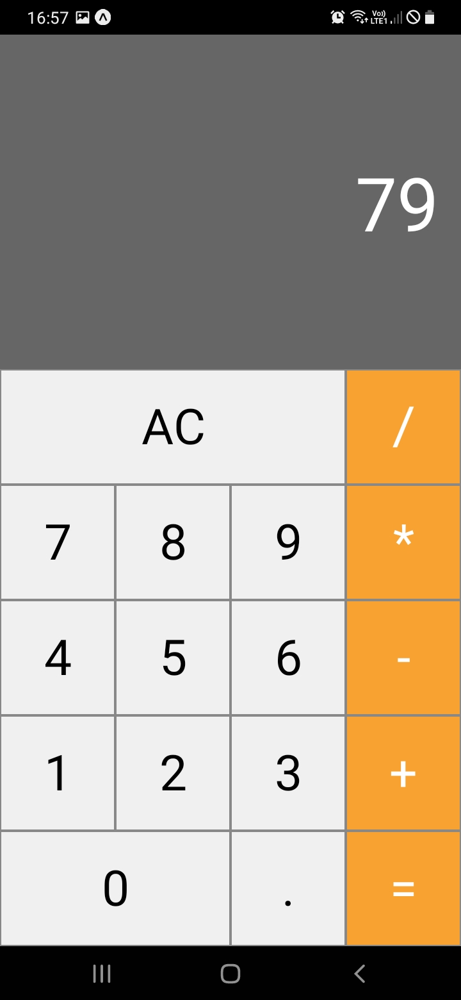
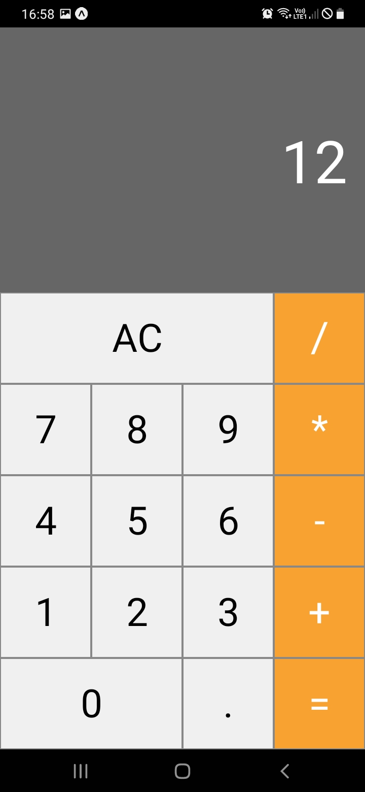
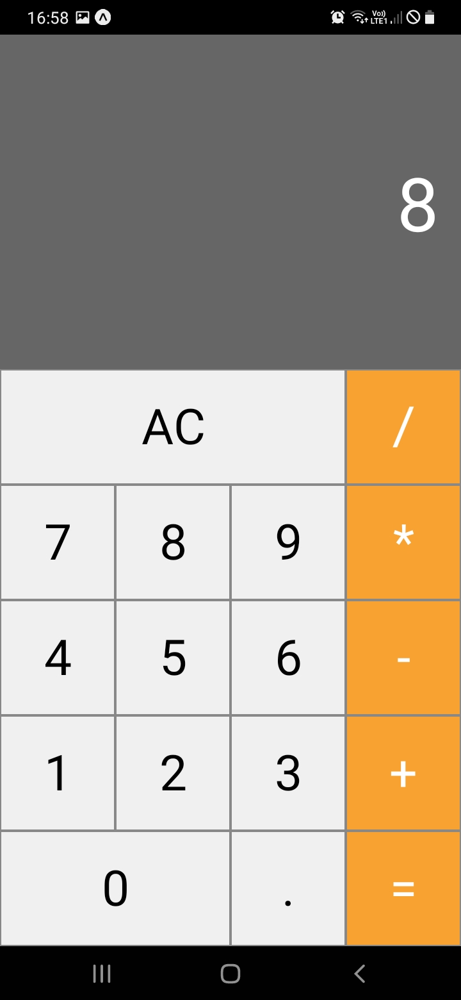

# Calculadora Mobile
Calculadora mobile desenvolvida com **react-native**, utilizando com base o **Expo**
 
 
## Tecnologias utilizadas

<ul>
  <li>React Native</li>
  <li>Expo</li>
</ul>
 
 

## Snipets - Soma

  

  

  

 
 

## Snipets - Divisão

  

  

  

